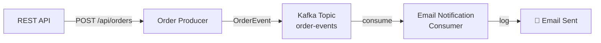

# Lesson 01 — Simple Pub/Sub

## Scenario

An e-commerce platform needs to send email confirmations when orders are placed. The **order service** publishes an event to Kafka whenever a new order is created. The **notification service** consumes those events and sends email confirmations.



## Kafka Concepts Covered

- [Topics](../docs/01-topics.md) — a named stream of records (`order-events`)
- [Producers](../docs/02-producers.md) — applications that write messages to a topic
- [Consumers](../docs/03-consumers.md) — applications that read messages from a topic
- [Consumer Groups](../docs/04-consumer-groups.md) — consumers that share the work of reading a topic (`email-notification-group`)
- [Message Keys](../docs/05-message-keys.md) — the `orderId` is used as the key, ensuring all events for the same order land on the same partition
- [JSON Serialization](../docs/06-json-serialization.md) — Spring Kafka's `JsonSerializer`/`JsonDeserializer` for structured messages
- [Offsets](../docs/07-offsets.md) — Kafka tracks where each consumer group has read up to

## Architecture

| Service | Port | Role |
|---------|------|------|
| Kafka (KRaft) | 9092 | Message broker |
| Order Producer | 8080 | REST API + Kafka producer |
| Email Consumer | — | Kafka consumer, logs output |
| AKHQ | 8888 | Web UI — topic browser, live messages, consumer group lag |

## Running

```bash
./start.sh
```

This will build both Spring Boot apps inside Docker (first run downloads Maven dependencies — takes a few minutes), start Kafka in KRaft mode, launch AKHQ, and begin auto-generating orders every 10 seconds. Chrome opens automatically to the AKHQ live message view.

## Exploring

### AKHQ — Visual Kafka Dashboard

AKHQ opens automatically at [localhost:8888](http://localhost:8888). Key views:

| View | URL | What to observe |
|------|-----|-----------------|
| **Live Messages** | [order-events/data](http://localhost:8888/ui/kafka-playbook/topic/order-events/data?sort=NEWEST&partition=All) | Watch OrderEvent JSON payloads arrive every 10 seconds |
| **Topic Detail** | [order-events](http://localhost:8888/ui/kafka-playbook/topic/order-events) | Partition count, replication, message count, size |
| **Consumer Groups** | [groups](http://localhost:8888/ui/kafka-playbook/group) | See `email-notification-group` offset lag per partition |
| **All Topics** | [topics](http://localhost:8888/ui/kafka-playbook/topic) | Internal topics (`__consumer_offsets`) + your `order-events` |

Things to try in AKHQ:
- Click a message row to expand the full JSON payload, headers, key, and partition/offset
- Filter messages by key (e.g., `ORD-1001`) to see all events for one order
- Watch the consumer group lag — it should stay near 0 as the consumer keeps up
- Stop the consumer (`docker compose stop consumer`) and watch lag increase, then restart it (`docker compose start consumer`) and watch it catch up

### Watch the consumer process orders

```bash
docker compose logs -f consumer
```

You should see output like:

```
============================================
  EMAIL NOTIFICATION
--------------------------------------------
  To:      alice@example.com
  Order:   ORD-1001
  Product: Wireless Headphones (x2)
  Total:   $79.98
  Status:  CONFIRMED
============================================
```

### Send a custom order

```bash
curl -X POST http://localhost:8080/api/orders \
  -H "Content-Type: application/json" \
  -d '{
    "customerEmail": "you@example.com",
    "productName": "Mechanical Keyboard",
    "quantity": 1,
    "totalPrice": 149.99
  }'
```

### Send a random sample order

```bash
curl -X POST http://localhost:8080/api/orders/sample
```

### Inspect the topic

```bash
docker compose exec kafka /opt/kafka/bin/kafka-topics.sh \
  --bootstrap-server localhost:9092 --describe --topic order-events
```

### Read raw messages from the topic

```bash
docker compose exec kafka /opt/kafka/bin/kafka-console-consumer.sh \
  --bootstrap-server localhost:9092 --topic order-events --from-beginning
```

## Key Takeaways

1. **Decoupling** — the producer doesn't know or care who consumes its events. You could add a second consumer (analytics, audit) without changing the producer.
2. **Message keys** — using `orderId` as the key means Kafka guarantees ordering for events about the same order within a partition.
3. **Consumer groups** — the `email-notification-group` tracks its own offset. If you restart the consumer, it picks up where it left off.
4. **Schema duplication** — both apps define their own `OrderEvent` record. In production, you'd use a Schema Registry or shared library. Lesson 12 covers this.

## Teardown

```bash
docker compose down -v
```
