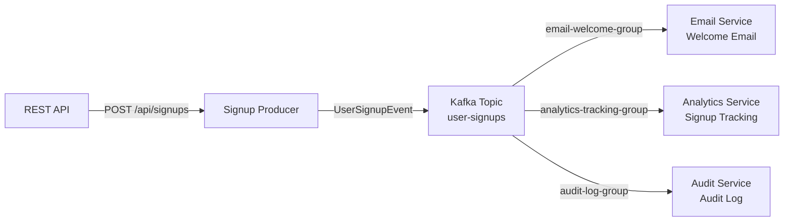

# Lesson 02 — Fan-Out (Broadcast)

## Scenario

A user signs up for your platform. Three independent services need to react to that single event:

1. **Email Service** — sends a welcome email
2. **Analytics Service** — tracks the signup for metrics and plan distribution
3. **Audit Service** — writes a structured audit log entry

Each service runs in its own **consumer group**, so every service receives every message independently. This is the fan-out (broadcast) pattern.



## Kafka Concepts Covered

- [Topics](../docs/01-topics.md) — a named stream of records (`user-signups`)
- [Producers](../docs/02-producers.md) — the signup service publishes one event per signup
- [Consumers](../docs/03-consumers.md) — three independent consumers each process the same events
- [Consumer Groups](../docs/04-consumer-groups.md) — the key to fan-out: each service uses a **different** group ID, so Kafka delivers every message to every group
- [Message Keys](../docs/05-message-keys.md) — `userId` as the key ensures ordering per user
- [JSON Serialization](../docs/06-json-serialization.md) — Spring Kafka's `JsonSerializer`/`JsonDeserializer` for structured messages
- [Offsets](../docs/07-offsets.md) — each consumer group tracks its own offset independently

## Architecture

| Service | Port | Role |
|---------|------|------|
| Kafka (KRaft) | 9092 | Message broker |
| Signup Producer | 8080 | REST API + Kafka producer, auto-generates signups every 10s |
| Email Consumer | 8081 | Kafka consumer (`email-welcome-group`), logs welcome emails |
| Analytics Consumer | 8082 | Kafka consumer (`analytics-tracking-group`), logs analytics events |
| Audit Consumer | 8083 | Kafka consumer (`audit-log-group`), logs structured audit entries |
| AKHQ | 8888 | Web UI — topic browser, live messages, consumer group lag |

## Running

```bash
./start.sh
```

This will build all four Spring Boot apps inside Docker (first run downloads Maven dependencies — takes a few minutes), start Kafka in KRaft mode, launch AKHQ, and begin auto-generating signups every 10 seconds. Chrome opens automatically to the AKHQ live message view.

## Exploring

### AKHQ — Visual Kafka Dashboard

AKHQ opens automatically at [localhost:8888](http://localhost:8888). Key views:

| View | URL | What to observe |
|------|-----|-----------------|
| **Live Messages** | [user-signups/data](http://localhost:8888/ui/kafka-playbook/topic/user-signups/data?sort=NEWEST&partition=All) | Watch UserSignupEvent JSON payloads arrive every 10 seconds |
| **Topic Detail** | [user-signups](http://localhost:8888/ui/kafka-playbook/topic/user-signups) | Partition count, replication, message count, size |
| **Consumer Groups** | [groups](http://localhost:8888/ui/kafka-playbook/group) | See all three consumer groups and their offset lag per partition |
| **All Topics** | [topics](http://localhost:8888/ui/kafka-playbook/topic) | Internal topics (`__consumer_offsets`) + your `user-signups` |

Things to try in AKHQ:
- Click a message row to expand the full JSON payload, headers, key, and partition/offset
- Filter messages by key (e.g., `USR-1001`) to see all events for one user
- Watch all three consumer groups — each should have its own offset, all staying near 0 lag
- Stop one consumer (`docker compose stop email-consumer`) and watch its group's lag increase while the others stay at 0. Restart it (`docker compose start email-consumer`) and watch it catch up

### Watch all consumers process signups

```bash
docker compose logs -f email-consumer analytics-consumer audit-consumer
```

You should see output like:

**Email Consumer:**
```
============================================
  WELCOME EMAIL
--------------------------------------------
  To:      alice@gmail.com
  Name:    Alice Johnson
  Plan:    PRO
  Subject: Welcome to our platform, Alice!
============================================
```

**Analytics Consumer:**
```
[ANALYTICS] New signup tracked: USR-1001 | Plan: PRO | Source: organic
```

**Audit Consumer:**
```
[AUDIT] 2024-03-27T12:00:00Z | SIGNUP | userId=USR-1001 | email=alice@gmail.com | plan=PRO
```

### Send a custom signup

```bash
curl -X POST http://localhost:8080/api/signups \
  -H "Content-Type: application/json" \
  -d '{
    "email": "you@example.com",
    "name": "Your Name",
    "plan": "ENTERPRISE"
  }'
```

### Send a random sample signup

```bash
curl -X POST http://localhost:8080/api/signups/sample
```

### Inspect the topic

```bash
docker compose exec kafka /opt/kafka/bin/kafka-topics.sh \
  --bootstrap-server localhost:9092 --describe --topic user-signups
```

### Read raw messages from the topic

```bash
docker compose exec kafka /opt/kafka/bin/kafka-console-consumer.sh \
  --bootstrap-server localhost:9092 --topic user-signups --from-beginning
```

### Compare consumer group offsets

```bash
docker compose exec kafka /opt/kafka/bin/kafka-consumer-groups.sh \
  --bootstrap-server localhost:9092 --describe --all-groups
```

## Testing

The producer project includes end-to-end tests that verify the fan-out pattern using **Testcontainers** and **Awaitility**.

### Running tests

From within Docker:
```bash
docker compose exec producer sh -c "cd /app && mvn test"
```

Or locally (requires Docker running for Testcontainers):
```bash
cd producer && mvn test
```

### Approach

Tests use **Testcontainers** to spin up a real Kafka broker (Confluent CP Kafka 7.6.1) in a Docker container. The `FanOutFlowTest` is self-contained: it produces signup events using the Spring `SignupProducerService`, then creates three independent `KafkaConsumer` instances with different group IDs to verify each group receives every message.

**BDD naming convention** — each test uses `@DisplayName` with Given/When/Then:
```java
@Test
@DisplayName("Given a user signup event is published, " +
        "when three consumer groups subscribe to the same topic, " +
        "then each group independently receives the event")
void givenSignupPublished_whenThreeGroupsSubscribe_thenEachReceivesEvent() {
```

### Test file

| Project | Test class | Scenarios |
|---------|-----------|-----------|
| producer | `FanOutFlowTest` | Verifies three consumer groups each independently receive the same event; verifies two events are received by all groups with independent offset tracking |

### Best practices for Kafka testing

- **Async assertions with Awaitility** — Kafka consumers are asynchronous, so tests use polling loops with timeouts instead of `Thread.sleep()`
- **Testcontainers vs EmbeddedKafka** — Testcontainers runs a real Kafka broker, catching serialization and configuration issues that EmbeddedKafka might miss
- **Independent consumer groups** — the test creates three separate consumer groups to simulate the fan-out pattern, verifying that Kafka delivers every message to every group
- **Test serialization separately** — in production, consider unit tests for your serializer/deserializer configurations independent of the full Kafka flow

## Key Takeaways

1. **Fan-out via consumer groups** — each service uses a different `group.id`, so Kafka delivers every message to every group independently. One topic, N consumers, each gets everything.
2. **Independent processing** — each consumer group tracks its own offsets. If the email service falls behind, the analytics and audit services are unaffected.
3. **Same topic, different reactions** — one `UserSignupEvent` triggers a welcome email, an analytics entry, and an audit log. The producer doesn't know or care how many services are listening.
4. **Scalability** — within a single consumer group, you could add more instances to share the partition load. Across groups, each group independently scales.
5. **Schema duplication** — all four apps define their own `UserSignupEvent` record. In production, you'd use a Schema Registry or shared library. Lesson 12 covers this.

## Teardown

```bash
docker compose down -v
```
