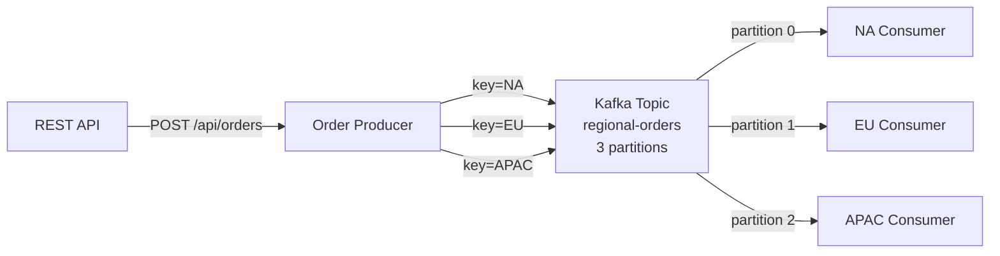

# Lesson 03 — Partitioned Processing

## Scenario

An e-commerce platform processes orders from three regions: **North America (NA)**, **Europe (EU)**, and **Asia-Pacific (APAC)**. Each region has a dedicated consumer that only handles orders for its region. The producer uses the **region as the partition key**, ensuring all orders for the same region land on the same partition and are processed in order by the regional consumer.



## Kafka Concepts Covered

- **Partition Keys** — the region string (NA, EU, APAC) is used as the message key, so Kafka's partitioner hashes it to a consistent partition
- **Ordering Guarantees** — messages with the same key always go to the same partition, guaranteeing order within a region
- **Partition Assignment** — each consumer in a different consumer group reads all partitions, but filters for its region
- **Key-based Routing** — choosing a meaningful key (region instead of orderId) changes the data distribution pattern
- **Consumer Groups** — each regional consumer uses its own group, so all three see every message but only process their region's orders

## Architecture

| Service | Port | Role |
|---------|------|------|
| Kafka (KRaft) | 9092 | Message broker |
| Order Producer | 8080 | REST API + Kafka producer, sends with region as key |
| NA Consumer | 8081 | Processes North America orders |
| EU Consumer | 8082 | Processes Europe orders |
| APAC Consumer | 8083 | Processes Asia-Pacific orders |
| AKHQ | 8888 | Web UI — topic browser, live messages, consumer group lag |

## Running

```bash
./start.sh
```

This will build the producer and consumer Spring Boot apps inside Docker (first run downloads Maven dependencies — takes a few minutes), start Kafka in KRaft mode, launch three regional consumers and AKHQ, and begin auto-generating orders every 10 seconds. Chrome opens automatically to the AKHQ live message view.

## Exploring

### AKHQ — Visual Kafka Dashboard

AKHQ opens automatically at [localhost:8888](http://localhost:8888). Key views:

| View | URL | What to observe |
|------|-----|-----------------|
| **Live Messages** | [regional-orders/data](http://localhost:8888/ui/kafka-playbook/topic/regional-orders/data?sort=NEWEST&partition=All) | Watch orders arrive with region keys (NA, EU, APAC) |
| **Topic Detail** | [regional-orders](http://localhost:8888/ui/kafka-playbook/topic/regional-orders) | 3 partitions, see message distribution across partitions |
| **Consumer Groups** | [groups](http://localhost:8888/ui/kafka-playbook/group) | See `na-region-group`, `eu-region-group`, `apac-region-group` offset lag |
| **All Topics** | [topics](http://localhost:8888/ui/kafka-playbook/topic) | Internal topics + your `regional-orders` |

Things to try in AKHQ:
- Click a message row to see the key (NA/EU/APAC), value (JSON order), partition, and offset
- Filter by partition to see that all messages in one partition share the same key
- Filter messages by key (e.g., `NA`) to see all North America orders grouped together
- Watch the three consumer groups — each processes the same messages but filters for its region
- Stop a consumer (`docker compose stop na-consumer`) and watch its group lag increase, then restart it and watch it catch up

### Watch regional consumers process orders

```bash
docker compose logs -f na-consumer     # North America orders only
docker compose logs -f eu-consumer     # Europe orders only
docker compose logs -f apac-consumer   # Asia-Pacific orders only
```

You should see output like:

```
============================================
  [NA] ORDER PROCESSED
--------------------------------------------
  Order:    ORD-1001
  Customer: John Smith
  Product:  Laptop Pro 16
  Amount:   $1,299.99
  Region:   North America
============================================
```

### Send a custom order

```bash
curl -X POST http://localhost:8080/api/orders \
  -H "Content-Type: application/json" \
  -d '{
    "region": "EU",
    "customerName": "Hans Mueller",
    "product": "Mechanical Keyboard",
    "amount": 149.99
  }'
```

### Send a random sample order

```bash
curl -X POST http://localhost:8080/api/orders/sample
```

### Inspect the topic

```bash
docker compose exec kafka /opt/kafka/bin/kafka-topics.sh \
  --bootstrap-server localhost:9092 --describe --topic regional-orders
```

### Read raw messages from the topic

```bash
docker compose exec kafka /opt/kafka/bin/kafka-console-consumer.sh \
  --bootstrap-server localhost:9092 --topic regional-orders --from-beginning \
  --property print.key=true --property key.separator=" -> "
```

## Key Takeaways

1. **Partition key choice matters** — using `region` as the key means all orders for the same region go to the same partition, guaranteeing ordering within a region. If we used `orderId` instead, orders would be spread across all partitions randomly.
2. **Same partition = same order** — Kafka guarantees that messages within a single partition are delivered in the order they were produced. All NA orders arrive in order, all EU orders arrive in order.
3. **Consumer groups per region** — each regional consumer uses its own consumer group, so all three consumers see every message. The filtering happens in application code, not in Kafka.
4. **Key distribution** — with only 3 distinct keys (NA, EU, APAC) and 3 partitions, the hash-based partitioner maps each key to a specific partition. In AKHQ, you can verify that each partition contains messages for exactly one region.

## Teardown

```bash
docker compose down -v
```
