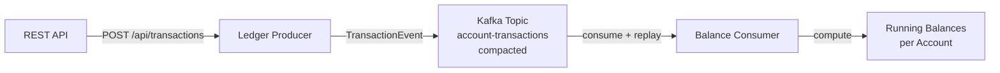

# Lesson 04 — Event Sourcing

## Scenario

A bank account ledger where every debit and credit is stored as an immutable event. The **ledger producer** publishes transaction events to a compacted Kafka topic. The **balance consumer** replays the full event log to compute running balances per account. This demonstrates event sourcing — the log _is_ the source of truth.



## Kafka Concepts Covered

- **Log Compaction** — Kafka retains at least the last value for each key. The `account-transactions` topic uses `cleanup.policy=compact`, so the broker will eventually remove older records with the same key, keeping the latest per account. This is different from time-based retention.
- **Event Replay** — the consumer reads from the earliest offset (`auto-offset-reset: earliest`), replaying the full history to rebuild state. If the consumer restarts, it can recompute all balances from scratch.
- **Event Schema Design** — each `TransactionEvent` carries a `transactionId`, `accountId`, `type` (CREDIT/DEBIT), `amount`, `description`, and `timestamp`. The `accountId` is used as the Kafka message key, ensuring all transactions for one account land on the same partition and are ordered.
- **Message Keys & Partitioning** — using `accountId` as the key guarantees per-account ordering within a partition, which is critical for computing correct balances.

## Architecture

| Service | Port | Role |
|---------|------|------|
| Kafka (KRaft) | 9092 | Message broker |
| Ledger Producer | 8080 | REST API + Kafka producer |
| Balance Consumer | 8081 | Kafka consumer, computes running balances |
| AKHQ | 8888 | Web UI — topic browser, live messages, consumer group lag |

## Running

```bash
./start.sh
```

This will build both Spring Boot apps inside Docker (first run downloads Maven dependencies — takes a few minutes), start Kafka in KRaft mode, launch AKHQ, and begin auto-generating transactions every 10 seconds. Chrome opens automatically to the AKHQ live message view.

## Exploring

### AKHQ — Visual Kafka Dashboard

AKHQ opens automatically at [localhost:8888](http://localhost:8888). Key views:

| View | URL | What to observe |
|------|-----|-----------------|
| **Live Messages** | [account-transactions/data](http://localhost:8888/ui/kafka-playbook/topic/account-transactions/data?sort=NEWEST&partition=All) | Watch TransactionEvent JSON payloads arrive every 10 seconds |
| **Topic Config** | [account-transactions](http://localhost:8888/ui/kafka-playbook/topic/account-transactions) | See `cleanup.policy=compact` in topic configuration |
| **Consumer Groups** | [groups](http://localhost:8888/ui/kafka-playbook/group) | See `balance-group` offset lag per partition |
| **All Topics** | [topics](http://localhost:8888/ui/kafka-playbook/topic) | Internal topics + your `account-transactions` |

Things to try in AKHQ:
- Click a message row to expand the full JSON payload, headers, key, and partition/offset
- Filter messages by key (e.g., `ACC-1001`) to see all transactions for one account
- Watch how multiple messages share the same key — compaction will eventually keep only the latest per key
- Stop the consumer (`docker compose stop consumer`) and watch lag increase, then restart it (`docker compose start consumer`) and watch it replay and catch up

### Watch the consumer compute balances

```bash
docker compose logs -f consumer
```

You should see output like:

```
============================================
  TRANSACTION RECORDED
--------------------------------------------
  TXN:      TXN-1001
  Account:  ACC-1001
  Type:     CREDIT
  Amount:   +$3,500.00
  Desc:     Salary deposit
  Balance:  $3,500.00
============================================
```

For debits:

```
============================================
  TRANSACTION RECORDED
--------------------------------------------
  TXN:      TXN-1005
  Account:  ACC-1001
  Type:     DEBIT
  Amount:   -$1,200.00
  Desc:     Monthly rent
  Balance:  $2,300.00
============================================
```

### Send a custom transaction

```bash
curl -X POST http://localhost:8080/api/transactions \
  -H "Content-Type: application/json" \
  -d '{
    "accountId": "ACC-1001",
    "type": "CREDIT",
    "amount": 500.00,
    "description": "Bonus payment"
  }'
```

### Send a random sample transaction

```bash
curl -X POST http://localhost:8080/api/transactions/sample
```

### Replay from the beginning

Stop and restart the consumer to see it replay all events and recompute balances:

```bash
docker compose stop consumer
docker compose start consumer
docker compose logs -f consumer
```

Because `auto-offset-reset` is `earliest` and the consumer group offsets are committed, a normal restart resumes from the last committed offset. To force a full replay, remove the consumer group:

```bash
docker compose exec kafka /opt/kafka/bin/kafka-consumer-groups.sh \
  --bootstrap-server localhost:9092 --group balance-group --delete
docker compose restart consumer
docker compose logs -f consumer
```

### Observe compaction behavior

Compaction runs in the background. To see its effect:

```bash
# Check topic configuration
docker compose exec kafka /opt/kafka/bin/kafka-topics.sh \
  --bootstrap-server localhost:9092 --describe --topic account-transactions

# Count messages — after compaction, duplicates per key are reduced
docker compose exec kafka /opt/kafka/bin/kafka-console-consumer.sh \
  --bootstrap-server localhost:9092 --topic account-transactions --from-beginning --property print.key=true
```

### Inspect the topic

```bash
docker compose exec kafka /opt/kafka/bin/kafka-topics.sh \
  --bootstrap-server localhost:9092 --describe --topic account-transactions
```

## Key Takeaways

1. **Event sourcing** — the Kafka topic is the source of truth. State (account balances) is derived by replaying the event log, not stored separately.
2. **Log compaction** — with `cleanup.policy=compact`, Kafka guarantees at least the last message per key is retained. This is useful for changelog topics where you want to keep the latest state per entity.
3. **Replay capability** — any consumer can rebuild its state by reading from the beginning. This makes it easy to add new consumers, fix bugs in processing logic, or migrate to a new data store.
4. **Key-based partitioning** — using `accountId` as the message key ensures all transactions for one account are on the same partition, preserving order and enabling correct balance computation.

## Teardown

```bash
docker compose down -v
```
