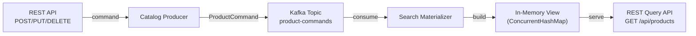

# Lesson 05 — CQRS (Command Query Responsibility Segregation)

## Scenario

A product catalog system separates its **write path** from its **read path**. The **catalog producer** accepts commands (create, update price, delete) via a REST API and publishes them to Kafka. The **query service** consumes those commands, builds an in-memory materialized view of the catalog, and exposes a read-only REST API for searching products. The two services are completely independent — they share nothing but a Kafka topic.



## Kafka Concepts Covered

- **CQRS** — Command Query Responsibility Segregation: the write model (commands) is completely separate from the read model (materialized view)
- **Materialized Views** — the query service rebuilds its entire state by replaying events from Kafka, acting as a source of truth
- **Separate Read/Write Paths** — the producer only writes; the query service only reads. They can be scaled, deployed, and evolved independently
- **Event Replay** — because the query service reads from `earliest`, it can reconstruct the full catalog state by replaying the topic from the beginning
- **Eventual Consistency** — after a command is published, there is a brief delay before the query service reflects the change

## Architecture

| Service | Port | Role |
|---------|------|------|
| Kafka (KRaft) | 9092 | Message broker |
| Catalog Producer | 8080 | REST API for write commands + Kafka producer |
| Query Service | 8081 | Kafka consumer + materialized view + REST query API |
| AKHQ | 8888 | Web UI — topic browser, live messages, consumer group lag |

## Running

```bash
./start.sh
```

This will build both Spring Boot apps inside Docker (first run downloads Maven dependencies — takes a few minutes), start Kafka in KRaft mode, launch AKHQ, and begin auto-generating product commands every 10 seconds.

## Exploring

### AKHQ — Visual Kafka Dashboard

AKHQ opens automatically at [localhost:8888](http://localhost:8888). Key views:

| View | URL | What to observe |
|------|-----|-----------------|
| **Live Messages** | [product-commands/data](http://localhost:8888/ui/kafka-playbook/topic/product-commands/data?sort=NEWEST&partition=All) | Watch ProductCommand JSON payloads arrive |
| **Topic Detail** | [product-commands](http://localhost:8888/ui/kafka-playbook/topic/product-commands) | Partition count, replication, message count |
| **Consumer Groups** | [groups](http://localhost:8888/ui/kafka-playbook/group) | See `product-materializer-group` offset lag per partition |

### Watch the materializer process commands

```bash
docker compose logs -f query-service
```

You should see output like:

```
[MATERIALIZER] CREATE  | PROD-1001 | 4K Monitor (Electronics) | $599.99
[MATERIALIZER] CREATE  | PROD-1002 | Wireless Mouse (Accessories) | $49.99
[MATERIALIZER] UPDATE  | PROD-1001 | 4K Monitor -> price: $549.99
[MATERIALIZER] DELETE  | PROD-1003 | Desk Lamp removed from catalog
[MATERIALIZER] View size: 5 products
```

### Create a product

```bash
curl -X POST http://localhost:8080/api/products \
  -H "Content-Type: application/json" \
  -d '{
    "name": "Mechanical Keyboard",
    "category": "Electronics",
    "price": 149.99
  }'
```

### Update a product price

```bash
curl -X PUT http://localhost:8080/api/products/PROD-1001/price \
  -H "Content-Type: application/json" \
  -d '{"price": 499.99}'
```

### Delete a product

```bash
curl -X DELETE http://localhost:8080/api/products/PROD-1001
```

### Generate a random sample command

```bash
curl -X POST http://localhost:8080/api/products/sample
```

### Query the materialized view

```bash
# List all products
curl -s http://localhost:8081/api/products | jq

# Get a specific product
curl -s http://localhost:8081/api/products/PROD-1001 | jq

# Search by category
curl -s "http://localhost:8081/api/products/search?category=Electronics" | jq
```

### Inspect the topic

```bash
docker compose exec kafka /opt/kafka/bin/kafka-topics.sh \
  --bootstrap-server localhost:9092 --describe --topic product-commands
```

### Read raw messages from the topic

```bash
docker compose exec kafka /opt/kafka/bin/kafka-console-consumer.sh \
  --bootstrap-server localhost:9092 --topic product-commands --from-beginning
```

## Key Takeaways

1. **CQRS** — the write path (producer -> Kafka) and the read path (query-service with in-memory view) are completely separate. They share no database, no state, and no direct communication.
2. **Materialized Views** — the query service rebuilds its catalog from the Kafka topic on startup. Kafka is the source of truth; the in-memory HashMap is a derived, queryable projection.
3. **Eventual Consistency** — after a product is created or updated, there is a brief delay before the query service reflects the change. This is a fundamental trade-off of CQRS.
4. **Independent Scaling** — you can scale the read path (many query-service replicas) independently of the write path. Read-heavy workloads don't impact writes, and vice versa.
5. **Event Replay** — because commands are persisted in Kafka, you can spin up a new query service instance and it will rebuild the full catalog by replaying from the beginning of the topic.

## Teardown

```bash
docker compose down -v
```
