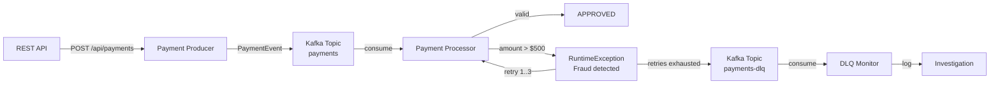

# Lesson 06 — Dead Letter Queue

## Scenario

A payment processing system validates incoming payments before approving them. Payments with amounts exceeding $500 are flagged as potential fraud and rejected. When the **payment processor** fails to process a payment, Spring Kafka retries the message (3 attempts with 1-second backoff). After exhausting all retries, the failed message is automatically routed to a **Dead Letter Queue (DLQ)** for investigation.



## Kafka Concepts Covered

- [[01-dead-letter-queues|Dead Letter Queues]] — a topic where messages that cannot be processed are sent after exhausting retries
- [[02-error-handling|Error Handling]] — Spring Kafka's `DefaultErrorHandler` with configurable retry policies
- [[03-retry-backoff|Retry with Backoff]] — `FixedBackOff(1000, 3)` retries a failed message 3 times with 1-second delays
- [[04-dead-letter-publishing-recoverer|DeadLetterPublishingRecoverer]] — automatically publishes failed records to a `.DLQ` topic
- [[05-manual-offset-management|Offset Management]] — failed messages are not committed until retries are exhausted and the DLQ receives them
- [[06-consumer-groups|Consumer Groups]] — separate groups for the processor (`payment-processor-group`) and DLQ monitor (`dlq-monitor-group`)
- [[07-topic-design|Topic Design]] — using separate topics for main flow (`payments`), and dead letters (`payments-dlq`)

## Architecture

| Service | Port | Role |
|---------|------|------|
| Kafka (KRaft) | 9092 | Message broker |
| Payment Producer | 8080 | REST API + Kafka producer, generates sample payments |
| Payment Processor | 8081 | Kafka consumer, validates payments, retries + DLQ on failure |
| AKHQ | 8888 | Web UI — topic browser, live messages, consumer group lag |

## Running

```bash
./start.sh
```

This will build both Spring Boot apps inside Docker (first run downloads Maven dependencies — takes a few minutes), start Kafka in KRaft mode, launch AKHQ, and begin auto-generating payments every 10 seconds. ~30% of payments will exceed $500 and trigger the DLQ flow. Chrome opens automatically to the AKHQ live message view.

## Exploring

### AKHQ — Visual Kafka Dashboard

AKHQ opens automatically at [localhost:8888](http://localhost:8888). Key views:

| View | URL | What to observe |
|------|-----|-----------------|
| **Payments Topic** | [payments/data](http://localhost:8888/ui/kafka-playbook/topic/payments/data?sort=NEWEST&partition=All) | All incoming payment events |
| **DLQ Topic** | [payments-dlq/data](http://localhost:8888/ui/kafka-playbook/topic/payments-dlq/data?sort=NEWEST&partition=All) | Failed payments after retry exhaustion |
| **Consumer Groups** | [groups](http://localhost:8888/ui/kafka-playbook/group) | See `payment-processor-group` and `dlq-monitor-group` lag |
| **All Topics** | [topics](http://localhost:8888/ui/kafka-playbook/topic) | `payments`, `payments-retry`, `payments-dlq`, and internal topics |

Things to try in AKHQ:
- Compare the `payments` topic with `payments-dlq` — every message in the DLQ should have an amount > $500
- Click a DLQ message to inspect the headers — Spring Kafka adds `kafka_dlt-exception-fqcn`, `kafka_dlt-exception-message`, and `kafka_dlt-original-topic`
- Watch the consumer group lag for `payment-processor-group` — it may spike briefly during retries
- Filter the `payments` topic by key to trace a specific payment through the system

### Watch the processor handle payments

```bash
docker compose logs -f processor
```

You should see successful payments:

```
============================================
  PAYMENT PROCESSED
--------------------------------------------
  Payment:  PAY-1001
  Order:    ORD-5001
  Amount:   $149.99 USD
  Card:     ****4532
  Status:   APPROVED
============================================
```

And failed payments landing in the DLQ:

```
!!! DEAD LETTER QUEUE !!!
============================================
  PAYMENT FAILED — SENT TO DLQ
--------------------------------------------
  Payment:  PAY-1003
  Order:    ORD-5003
  Amount:   $892.50 USD
  Card:     ****7891
  Reason:   Fraud detected
  Retries:  3/3 exhausted
============================================
```

### Send a custom payment

```bash
curl -X POST http://localhost:8080/api/payments \
  -H "Content-Type: application/json" \
  -d '{
    "orderId": "ORD-9999",
    "amount": 750.00,
    "currency": "USD",
    "cardLast4": "1234",
    "customerEmail": "test@example.com"
  }'
```

This payment ($750) will exceed the $500 threshold and end up in the DLQ after 3 retries.

### Send a random sample payment

```bash
curl -X POST http://localhost:8080/api/payments/sample
```

### Inspect the DLQ topic

```bash
docker compose exec kafka /opt/kafka/bin/kafka-console-consumer.sh \
  --bootstrap-server localhost:9092 --topic payments-dlq --from-beginning
```

### Describe all topics

```bash
docker compose exec kafka /opt/kafka/bin/kafka-topics.sh \
  --bootstrap-server localhost:9092 --describe --topic payments
docker compose exec kafka /opt/kafka/bin/kafka-topics.sh \
  --bootstrap-server localhost:9092 --describe --topic payments-dlq
```

## Key Takeaways

1. **Dead Letter Queues** — DLQs prevent poison-pill messages from blocking the entire consumer. Failed messages are safely parked for later investigation or reprocessing.
2. **Retry before DLQ** — Spring Kafka's `DefaultErrorHandler` with `FixedBackOff` retries transient failures before giving up. This handles temporary issues (network blips, database timeouts) without losing messages.
3. **DLQ headers** — Spring Kafka automatically adds exception details, original topic, partition, and offset as headers on DLQ messages. This metadata is essential for debugging in production.
4. **Separate monitoring** — the `dlq-monitor-group` consumes from `payments-dlq` independently, allowing alerting, dashboards, or automated reprocessing pipelines.
5. **Topic design** — using dedicated topics (`payments`, `payments-dlq`) with appropriate partition counts (3 for throughput on main topic, 1 for the low-volume DLQ) is a common production pattern.

## Teardown

```bash
docker compose down -v
```
