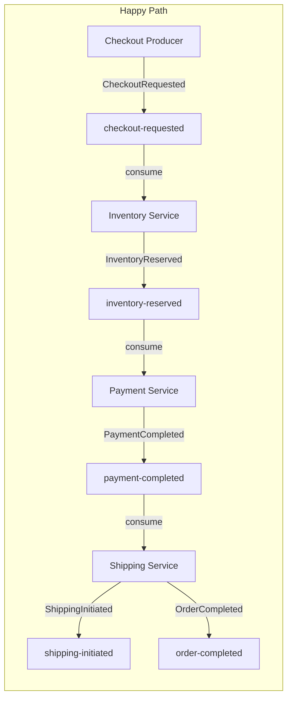
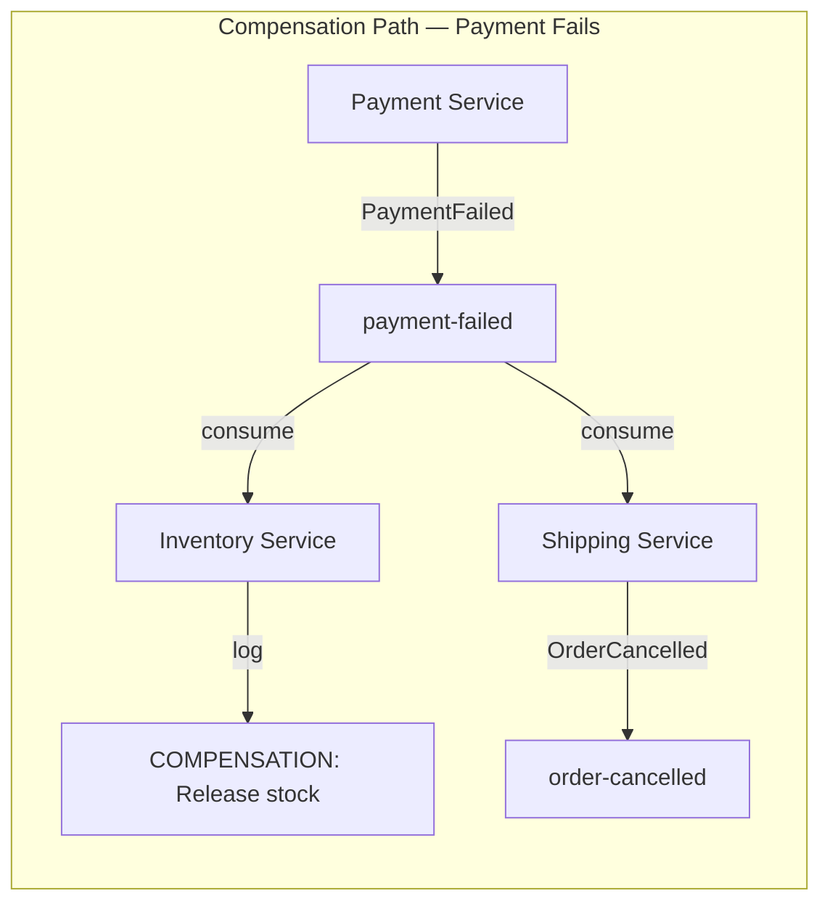
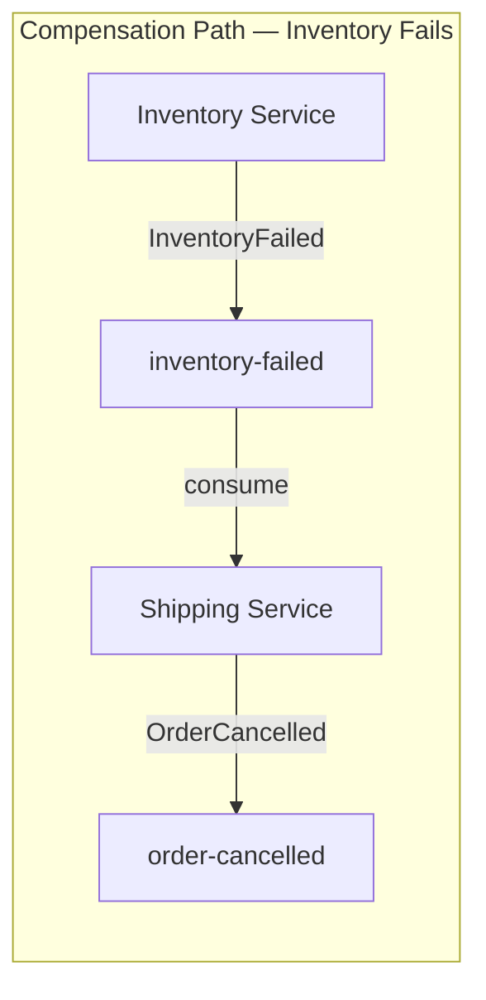

# Lesson 07 — Saga / Choreography

## Scenario

An e-commerce checkout flow implemented as a choreography-based saga. When a customer checks out, events flow through a chain of independent services: **checkout** -> **inventory** -> **payment** -> **shipping**. Each service listens on one topic and publishes to the next. If any step fails, compensating events flow backward to undo previous steps.







## Kafka Concepts Covered

- **Multi-topic coordination** — a single business transaction spans 8 topics, each representing a step or outcome in the saga
- **Compensating events** — when payment fails, a `payment-failed` event triggers the inventory service to release reserved stock
- **Correlation IDs** — every event carries the original `orderId`, allowing you to trace a single checkout through all topics
- **Choreography vs Orchestration** — in choreography, each service independently reacts to events and publishes its own; there is no central coordinator. Compare this to orchestration (Lesson 08) where a single orchestrator directs the flow.
- **Eventual consistency** — the order is not "complete" until the final `order-completed` event. Intermediate states (reserved, paid) are visible in the topics.

## Architecture

| Service | Port | Role |
|---------|------|------|
| Kafka (KRaft) | 9092 | Message broker |
| Checkout Producer | 8080 | Generates checkout requests, creates all topics |
| Inventory Service | 8081 | Reserves/releases inventory |
| Payment Service | 8082 | Processes payments (~20% failure rate) |
| Shipping Service | 8083 | Initiates shipping, emits final status |
| AKHQ | 8888 | Web UI — topic browser, live messages, consumer group lag |

## Running

```bash
./start.sh
```

This will build all four Spring Boot apps inside Docker (first run downloads Maven dependencies — takes a few minutes), start Kafka in KRaft mode, launch AKHQ, and begin auto-generating checkout requests every 10 seconds.

## Exploring

### AKHQ — Visual Kafka Dashboard

AKHQ opens automatically at [localhost:8888](http://localhost:8888). Key views:

| View | URL | What to observe |
|------|-----|-----------------|
| **All Topics** | [topics](http://localhost:8888/ui/kafka-playbook/topic) | See all 8 saga topics |
| **checkout-requested** | [checkout-requested](http://localhost:8888/ui/kafka-playbook/topic/checkout-requested/data?sort=NEWEST&partition=All) | Initial checkout events |
| **inventory-reserved** | [inventory-reserved](http://localhost:8888/ui/kafka-playbook/topic/inventory-reserved/data?sort=NEWEST&partition=All) | Successful reservations |
| **payment-completed** | [payment-completed](http://localhost:8888/ui/kafka-playbook/topic/payment-completed/data?sort=NEWEST&partition=All) | Successful payments |
| **payment-failed** | [payment-failed](http://localhost:8888/ui/kafka-playbook/topic/payment-failed/data?sort=NEWEST&partition=All) | Failed payments (triggers compensation) |
| **order-completed** | [order-completed](http://localhost:8888/ui/kafka-playbook/topic/order-completed/data?sort=NEWEST&partition=All) | Final successful orders |
| **order-cancelled** | [order-cancelled](http://localhost:8888/ui/kafka-playbook/topic/order-cancelled/data?sort=NEWEST&partition=All) | Cancelled orders (compensation result) |
| **Consumer Groups** | [groups](http://localhost:8888/ui/kafka-playbook/group) | See inventory-group, payment-group, shipping-group |

Things to try in AKHQ:
- Click a message row to expand the full JSON payload, headers, key, and partition/offset
- Filter messages by key (e.g., `ORD-1001`) to trace one order through checkout-requested -> inventory-reserved -> payment-completed -> shipping-initiated -> order-completed
- Find a failed payment in `payment-failed` and trace the same orderId in `order-cancelled` and inventory logs
- Watch the consumer group lag for each service

### Watch the saga flow end to end

```bash
docker compose logs -f checkout-producer inventory-service payment-service shipping-service
```

### Watch compensation in action

```bash
docker compose logs -f inventory-service shipping-service | grep -E "COMPENSATION|CANCELLED"
```

### Send a manual checkout

```bash
curl -X POST http://localhost:8080/api/checkout/sample
```

### Inspect a topic

```bash
docker compose exec kafka /opt/kafka/bin/kafka-topics.sh \
  --bootstrap-server localhost:9092 --describe --topic checkout-requested
```

### List all topics

```bash
docker compose exec kafka /opt/kafka/bin/kafka-topics.sh \
  --bootstrap-server localhost:9092 --list
```

## Key Takeaways

1. **Saga pattern** — a saga is a sequence of local transactions. Each service performs its work and publishes an event. If a step fails, compensating events undo the previous steps.
2. **Choreography** — no central coordinator. Each service knows only about the events it consumes and produces. This is simple but can become hard to reason about as the number of services grows.
3. **Eventual consistency** — the system is consistent only after all events have been processed. Between steps, the order is in an intermediate state.
4. **Compensation** — the inventory service listens for `payment-failed` to release reserved stock. This is the "undo" mechanism. In a real system, each step that has side effects needs a corresponding compensating action.
5. **Correlation IDs** — the `orderId` flows through every event, making it possible to trace a single checkout across all topics. In production, you'd also add tracing headers (e.g., OpenTelemetry).

## Testing

### Running the integration test

The checkout-producer project includes an end-to-end test that verifies checkout events are correctly published to the `checkout-requested` topic. The test uses **Testcontainers** to spin up a real Kafka broker in Docker, so no external infrastructure is needed.

```bash
cd checkout-producer
mvn test
```

The test class `SagaFlowTest` covers:

| Test | What it verifies |
|------|-----------------|
| `givenCheckoutRequest_whenProducerPublishes_thenEventAppearsWithCorrectKey` | The event arrives on `checkout-requested` with the `orderId` as the Kafka message key |
| `givenCheckoutWithDetails_whenSerializedAndPublished_thenPayloadContainsAllDetails` | The JSON payload contains all fields: orderId, customerId, productName, quantity, totalAmount |

### A note on full saga testing

This test covers only the **producer side** of the saga. The complete choreography (checkout -> inventory -> payment -> shipping) spans four independent Spring Boot services, each with its own application context.

Full end-to-end saga testing would require either:

1. **Multi-context integration test** — start all four application contexts in a single JVM, each wired to the same Testcontainers Kafka broker. This is heavyweight but provides the highest confidence.
2. **Docker Compose test** — use the existing `docker-compose.yml` with a test runner that sends a checkout request and polls the `order-completed` / `order-cancelled` topics for the final outcome.
3. **Contract testing** — test each service in isolation against its input/output topic contracts. This is lighter-weight and fits well with choreography, where each service is an independent unit.

The current test takes approach (3) for the checkout-producer. Similar tests can be added to each downstream service to verify its individual consume-and-produce behavior.

## Teardown

```bash
docker compose down -v
```
