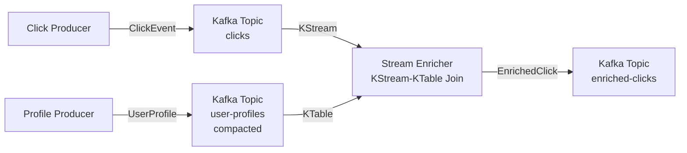

# Lesson 08 — Stream Enrichment

## Scenario

A clickstream analytics platform needs to enrich raw click events with user profile data. The **click producer** generates raw click events (userId, page, action). The **profile producer** seeds user profiles to a compacted topic. The **stream enricher** uses Kafka Streams to join the click stream with the user profile table, producing enriched click events that include the user's name and tier.



## Kafka Concepts Covered

- [Kafka Streams](../docs/11-kafka-streams.md) — a client library for building stream processing applications on top of Kafka
- [KTable](../docs/11-kafka-streams.md) — a changelog stream interpreted as a table; each key's latest value represents the current state
- Stream-Table Joins — enrich a stream of events by looking up the latest value for each key in a table
- [Log Compaction](../docs/13-event-sourcing.md) — topics with `cleanup.policy=compact` retain only the latest value per key, perfect for reference data
- [JSON Serialization](../docs/06-json-serialization.md) — serializer/deserializer pairs (Serdes) used by Kafka Streams for reading and writing records
- Stateful Processing — Kafka Streams maintains local state stores for KTables, enabling fast lookups without external databases

## Architecture

| Service | Port | Role |
|---------|------|------|
| Kafka (KRaft) | 9092 | Message broker |
| Click Producer | 8080 | Generates raw click events to `clicks` topic |
| Profile Producer | 8082 | Seeds user profiles to `user-profiles` compacted topic |
| Stream Enricher | 8081 | Kafka Streams app — joins clicks with profiles, writes to `enriched-clicks` |
| AKHQ | 8888 | Web UI — topic browser, live messages, consumer group lag |

## Running

```bash
./start.sh
```

This will build all three Spring Boot apps inside Docker (first run downloads Maven dependencies — takes a few minutes), start Kafka in KRaft mode, launch AKHQ, seed user profiles, and begin auto-generating click events every 10 seconds. Chrome opens automatically to the AKHQ enriched-clicks topic view.

## Exploring

### AKHQ — Visual Kafka Dashboard

AKHQ opens automatically at [localhost:8888](http://localhost:8888). Key views:

| View | URL | What to observe |
|------|-----|-----------------|
| **Raw Clicks** | [clicks/data](http://localhost:8888/ui/kafka-playbook/topic/clicks/data?sort=NEWEST&partition=All) | Raw click events with userId, page, action |
| **User Profiles** | [user-profiles/data](http://localhost:8888/ui/kafka-playbook/topic/user-profiles/data?sort=NEWEST&partition=All) | Compacted user profile data (name, email, tier) |
| **Enriched Clicks** | [enriched-clicks/data](http://localhost:8888/ui/kafka-playbook/topic/enriched-clicks/data?sort=NEWEST&partition=All) | Enriched events with user name and tier joined in |
| **All Topics** | [topics](http://localhost:8888/ui/kafka-playbook/topic) | All topics including internal Kafka Streams state stores |
| **Consumer Groups** | [groups](http://localhost:8888/ui/kafka-playbook/group) | See `stream-enricher` consumer group and lag |

Things to try in AKHQ:
- Compare a raw click in `clicks` with the corresponding enriched click in `enriched-clicks` — notice the added `userName` and `userTier` fields
- Look at the `user-profiles` topic — it has `cleanup.policy=compact`, so only the latest profile per userId is retained
- Watch the Kafka Streams internal topics (`stream-enricher-*-changelog`) that back the KTable state store
- Stop the stream-enricher (`docker compose stop stream-enricher`) and watch unprocessed clicks accumulate, then restart it and watch it catch up

### Watch the enriched output

```bash
docker compose logs -f stream-enricher
```

You should see output like:

```
[ENRICHED] USR-1001 (Alice Johnson, PRO) viewed /products at 2024-03-27T12:00:00Z
```

### Send a manual click

```bash
curl -X POST http://localhost:8080/api/clicks/sample
```

### Inspect the topics

```bash
# Describe the compacted user-profiles topic
docker compose exec kafka /opt/kafka/bin/kafka-topics.sh \
  --bootstrap-server localhost:9092 --describe --topic user-profiles

# Read raw clicks
docker compose exec kafka /opt/kafka/bin/kafka-console-consumer.sh \
  --bootstrap-server localhost:9092 --topic clicks --from-beginning

# Read enriched clicks
docker compose exec kafka /opt/kafka/bin/kafka-console-consumer.sh \
  --bootstrap-server localhost:9092 --topic enriched-clicks --from-beginning
```

## Key Takeaways

1. **Stream-table joins** — Kafka Streams can join a KStream (unbounded events) with a KTable (latest-value-per-key) to enrich events in real time, without an external database.
2. **Compacted topics as reference data** — Using `cleanup.policy=compact` on `user-profiles` means Kafka retains the latest profile for each userId indefinitely, acting as a lightweight key-value store.
3. **Stateful stream processing** — Kafka Streams materializes the KTable into a local RocksDB state store. Joins are fast local lookups, not remote calls.
4. **Key alignment** — The join works because both the click stream and the profile table use `userId` as the message key. Key alignment is essential for stream-table joins.
5. **Ordering guarantees** — Profiles must be seeded before clicks arrive, otherwise clicks for unknown users will be dropped by the inner join. In production, you might use a left join with a fallback.

## Teardown

```bash
docker compose down -v
```
