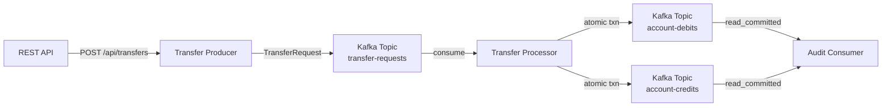

# Lesson 09 — Exactly-Once Processing

## Scenario

A financial platform processes account-to-account transfers. The **transfer producer** submits transfer requests to Kafka. The **transfer processor** reads each request and atomically produces a debit event and a credit event inside a single Kafka transaction. This guarantees exactly-once semantics — even if the processor crashes mid-way, no account is ever debited without the corresponding credit appearing.



## Kafka Concepts Covered

- **Idempotent Producers** — the producer assigns a sequence number to every message. If a network retry causes a duplicate send, the broker detects and deduplicates it automatically. Enabled by default in Kafka 3.x (`enable.idempotence=true`).
- **Transactional APIs** — `KafkaTemplate.executeInTransaction()` wraps multiple sends in a single atomic commit. Either all messages in the transaction are visible to consumers, or none are.
- **`read_committed` Isolation** — consumers configured with `isolation.level=read_committed` only see messages from committed transactions. Uncommitted or aborted messages are invisible, preventing dirty reads.
- **Exactly-Once Semantics (EOS)** — the combination of idempotent producers + transactional sends + `read_committed` consumers delivers end-to-end exactly-once processing. Each transfer request is processed exactly once, producing exactly one debit and one credit.
- **Transactional ID** — the `transaction-id-prefix` uniquely identifies the transactional producer. Kafka uses it to fence zombie instances (e.g., after a crash/restart) so that only one active producer per transactional ID can commit.

## Architecture

| Service | Port | Role |
|---------|------|------|
| Kafka (KRaft) | 9092 | Message broker with transaction support |
| Transfer Producer | 8080 | REST API + idempotent Kafka producer |
| Transfer Processor | 8081 | Transactional consumer-producer (read-process-write) |
| AKHQ | 8888 | Web UI — topic browser, transaction markers, consumer groups |

## Running

```bash
./start.sh
```

This will build both Spring Boot apps inside Docker (first run downloads Maven dependencies — takes a few minutes), start Kafka in KRaft mode, launch AKHQ, and begin auto-generating transfers every 10 seconds. The browser opens automatically to the AKHQ live message view.

## Exploring

### AKHQ — Visual Kafka Dashboard

AKHQ opens automatically at [localhost:8888](http://localhost:8888). Key views:

| View | URL | What to observe |
|------|-----|-----------------|
| **Transfer Requests** | [transfer-requests/data](http://localhost:8888/ui/kafka-playbook/topic/transfer-requests/data?sort=NEWEST&partition=All) | Incoming transfer request JSON payloads |
| **Account Debits** | [account-debits/data](http://localhost:8888/ui/kafka-playbook/topic/account-debits/data?sort=NEWEST&partition=All) | Debit events produced inside transactions |
| **Account Credits** | [account-credits/data](http://localhost:8888/ui/kafka-playbook/topic/account-credits/data?sort=NEWEST&partition=All) | Credit events produced inside transactions |
| **Consumer Groups** | [groups](http://localhost:8888/ui/kafka-playbook/group) | `transfer-processor-group` and `audit-group` offset lag |
| **All Topics** | [topics](http://localhost:8888/ui/kafka-playbook/topic) | Notice `__transaction_state` internal topic alongside your topics |

Things to try in AKHQ:
- Click a message in `account-debits` or `account-credits` to see headers and transactional metadata
- Look at `__transaction_state` topic to see transaction commit/abort markers
- Watch consumer group lag for both `transfer-processor-group` and `audit-group`
- Stop the processor (`docker compose stop processor`) and watch lag increase on `transfer-requests`, then restart and watch it catch up — no duplicate debits/credits appear

### Watch the processor handle transfers atomically

```bash
docker compose logs -f processor
```

You should see output like:

```
============================================
  TRANSFER PROCESSED (ATOMIC)
--------------------------------------------
  Transfer: TXF-1001
  From:     ACC-1001 → DEBIT  $250.00
  To:       ACC-1003 → CREDIT $250.00
  Desc:     Rent payment
  Status:   COMMITTED
============================================
```

And the audit trail:

```
[AUDIT-DEBIT]  TXF-1001 | ACC-1001 | -$250.00 | Rent payment
[AUDIT-CREDIT] TXF-1001 | ACC-1003 | +$250.00 | Rent payment
```

### Send a custom transfer

```bash
curl -X POST http://localhost:8080/api/transfers \
  -H "Content-Type: application/json" \
  -d '{
    "fromAccount": "ACC-1001",
    "toAccount": "ACC-1005",
    "amount": 75.00,
    "description": "Dinner split"
  }'
```

### Send a random sample transfer

```bash
curl -X POST http://localhost:8080/api/transfers/sample
```

### Inspect the topics

```bash
docker compose exec kafka /opt/kafka/bin/kafka-topics.sh \
  --bootstrap-server localhost:9092 --describe --topic transfer-requests

docker compose exec kafka /opt/kafka/bin/kafka-topics.sh \
  --bootstrap-server localhost:9092 --describe --topic account-debits

docker compose exec kafka /opt/kafka/bin/kafka-topics.sh \
  --bootstrap-server localhost:9092 --describe --topic account-credits
```

### Read raw messages (with read_committed isolation)

```bash
docker compose exec kafka /opt/kafka/bin/kafka-console-consumer.sh \
  --bootstrap-server localhost:9092 --topic account-debits --from-beginning \
  --isolation-level read_committed
```

## Key Takeaways

1. **Atomic multi-topic writes** — Kafka transactions let a processor read from one topic and write to multiple output topics atomically. Either all writes commit or none do. This is the foundation of exactly-once stream processing.
2. **Idempotence is free** — since Kafka 3.x, idempotent producers are enabled by default. Retries never produce duplicates within a single partition, even on network failures.
3. **`read_committed` is opt-in** — consumers must explicitly set `isolation.level=read_committed` to skip uncommitted messages. Without this, consumers see all messages regardless of transaction state.
4. **Transactional IDs fence zombies** — if a processor crashes and restarts, Kafka uses the transactional ID to abort any pending transaction from the old instance before the new one begins.
5. **Cost of exactly-once** — transactions add latency (the broker must coordinate commits) and reduce throughput. Use EOS where correctness matters (financial transfers, inventory, billing). For analytics or logging, at-least-once with idempotent consumers is usually sufficient.

## Testing

### Running the integration test

The processor project includes an end-to-end test that verifies the transactional consumer-producer pattern. The test uses **Testcontainers** to start a real Kafka broker in Docker, publishes a `TransferRequest`, and asserts that both the debit and credit events appear on their respective topics.

```bash
cd processor
mvn test
```

The test class `ExactlyOnceFlowTest` covers:

| Test | What it verifies |
|------|-----------------|
| `givenTransferRequest_whenProcessedTransactionally_thenDebitAndCreditAppear` | A transfer request produces both a debit on `account-debits` and a credit on `account-credits` with the correct account IDs and amounts |
| `givenTransferRequest_whenTransactionCommits_thenReadCommittedConsumerSeesBoth` | A consumer configured with `isolation.level=read_committed` sees the debit and credit only after the transaction commits — no dirty reads |

### What the transactional test proves

The second test (`readCommittedConsumerSeesBoth`) is significant because it uses a `read_committed` consumer. In Kafka, a `read_uncommitted` consumer (the default) can see messages before the transaction commits. By configuring `isolation.level=read_committed`, the test consumer will only return records from committed transactions. If the processor's transaction were to abort, the test consumer would never see those records.

This mirrors the production audit consumer, which also uses `read_committed` isolation to guarantee it only processes fully committed transfers.

## Teardown

```bash
docker compose down -v
```
