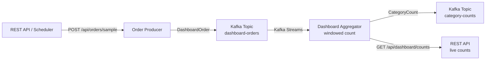

# Lesson 10 — Windowed Aggregation

## Scenario

A real-time analytics dashboard needs to count orders per product category in 1-minute tumbling windows. An **order producer** publishes orders to Kafka. A **Kafka Streams aggregator** reads those orders, groups them by category, counts them within time windows, and writes the results to an output topic. A REST endpoint exposes the current window counts.



## Kafka Concepts Covered

- **Kafka Streams** — a client library for building real-time streaming applications that transform, aggregate, and enrich data stored in Kafka topics
- **Tumbling Windows** — fixed-size, non-overlapping time windows (e.g., every 1 minute). Each event belongs to exactly one window.
- **Hopping Windows** — fixed-size, overlapping windows that advance by a hop interval (e.g., 1-minute windows every 30 seconds). An event can belong to multiple windows.
- **Session Windows** — dynamically sized windows that close after an inactivity gap. Useful for grouping bursts of activity.
- **State Stores** — Kafka Streams maintains local state (RocksDB by default) to support aggregations. State is backed by changelog topics for fault tolerance.
- **Windowed Keys** — aggregation results are keyed by a `Windowed<K>` type that includes both the original key and the window boundaries.
- **KGroupedStream** — the result of grouping a KStream by key, which enables aggregation operations like `count()`, `reduce()`, and `aggregate()`.

## Architecture

| Service | Port | Role |
|---------|------|------|
| Kafka (KRaft) | 9092 | Message broker |
| Order Producer | 8080 | REST API + scheduled order generation |
| Dashboard Aggregator | 8081 | Kafka Streams windowed count + REST API for live counts |
| AKHQ | 8888 | Web UI — topic browser, live messages, consumer group lag |

## Running

```bash
./start.sh
```

This will build both Spring Boot apps inside Docker (first run downloads Maven dependencies — takes a few minutes), start Kafka in KRaft mode, launch AKHQ, and begin auto-generating orders every 10 seconds. Your browser opens automatically to the AKHQ topic view.

## Exploring

### AKHQ — Visual Kafka Dashboard

AKHQ opens automatically at [localhost:8888](http://localhost:8888). Key views:

| View | URL | What to observe |
|------|-----|-----------------|
| **Dashboard Orders** | [dashboard-orders/data](http://localhost:8888/ui/kafka-playbook/topic/dashboard-orders/data?sort=NEWEST&partition=All) | Watch DashboardOrder JSON payloads arrive every 10 seconds |
| **Category Counts** | [category-counts/data](http://localhost:8888/ui/kafka-playbook/topic/category-counts/data?sort=NEWEST&partition=All) | Windowed aggregation results with category counts per window |
| **Consumer Groups** | [groups](http://localhost:8888/ui/kafka-playbook/group) | See the `dashboard-aggregator` streams app and `count-logger-group` |
| **All Topics** | [topics](http://localhost:8888/ui/kafka-playbook/topic) | Internal topics, changelog topics, and your application topics |

Things to try in AKHQ:
- View the `category-counts` topic — notice the windowed keys contain window start/end times
- Look for the `dashboard-aggregator-*-changelog` topics — these back the state store
- Watch consumer group lag for the streams application

### Watch the aggregator process counts

```bash
docker compose logs -f aggregator
```

You should see output like:

```
[COUNT] Electronics  | 3 orders | window: 12:00:00 - 12:01:00
[COUNT] Clothing     | 2 orders | window: 12:00:00 - 12:01:00
[COUNT] Books        | 1 orders | window: 12:00:00 - 12:01:00
[COUNT] Home & Garden| 4 orders | window: 12:00:00 - 12:01:00
[COUNT] Sports       | 1 orders | window: 12:00:00 - 12:01:00
```

### Query live counts via REST

```bash
curl -s http://localhost:8081/api/dashboard/counts | python3 -m json.tool
```

### Send a manual sample order

```bash
curl -X POST http://localhost:8080/api/orders/sample
```

### Inspect the topics

```bash
docker compose exec kafka /opt/kafka/bin/kafka-topics.sh \
  --bootstrap-server localhost:9092 --describe --topic dashboard-orders

docker compose exec kafka /opt/kafka/bin/kafka-topics.sh \
  --bootstrap-server localhost:9092 --describe --topic category-counts
```

### Read raw messages from the category-counts topic

```bash
docker compose exec kafka /opt/kafka/bin/kafka-console-consumer.sh \
  --bootstrap-server localhost:9092 --topic category-counts --from-beginning \
  --property print.key=true --property key.separator=" -> "
```

## Key Takeaways

1. **Windowed aggregation** — Kafka Streams makes it simple to group events into time windows and compute aggregates (counts, sums, averages) without external databases.
2. **State stores** — aggregations are backed by local state stores (RocksDB). Kafka Streams automatically creates changelog topics to make state fault-tolerant and recoverable.
3. **Tumbling vs. hopping vs. session** — choose the window type that matches your use case. Tumbling windows give non-overlapping counts, hopping windows give smoothed/overlapping views, and session windows adapt to activity patterns.
4. **Windowed keys** — the output of a windowed aggregation includes the window boundaries in the key, which is important for downstream consumers to interpret correctly.
5. **Real-time dashboards** — combining Kafka Streams state stores with a REST endpoint gives you a live-queryable dashboard without any external database.

## Testing

This lesson includes end-to-end BDD tests using **Testcontainers** with a real Kafka broker. The tests are in the `aggregator` project.

### Running the tests

```bash
cd aggregator && mvn test
```

### Test scenarios

The test class `WindowedAggregationTest` verifies two scenarios using `@SpringBootTest` + `@Testcontainers` + `KafkaContainer`:

1. **Given orders arrive within the same 1-minute window, when aggregated by category, then the count reflects the total orders per category in that window** -- Produces 5 orders (3 Electronics, 2 Clothing) with timestamps within the same minute, then consumes from the `category-counts` topic and asserts the correct counts appear.

2. **Given orders span two different 1-minute windows, when aggregated, then each window has its own independent count** -- Produces orders with timestamps in two distinct minute windows and verifies that the aggregator emits separate counts per window.

The tests use `@DynamicPropertySource` to inject the Testcontainers Kafka bootstrap servers into the Spring context, and **Awaitility** to wait for the Kafka Streams topology to process and emit results.

### Dependencies added

- `spring-boot-starter-test` -- JUnit 5, AssertJ, Mockito
- `spring-kafka-test` -- Kafka testing utilities
- `kafka-streams-test-utils` -- Kafka Streams testing support
- `testcontainers:kafka` -- Kafka container for integration tests
- `testcontainers:junit-jupiter` -- JUnit 5 integration for Testcontainers
- `awaitility` -- fluent async assertions

## Teardown

```bash
docker compose down -v
```
