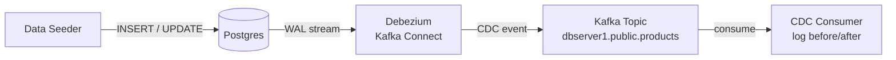

# Lesson 11 — Change Data Capture

## Scenario

An e-commerce platform stores its product catalog in Postgres. Whenever a product is inserted, updated, or deleted, the change needs to be captured in real time — without modifying the application code. **Debezium** monitors the Postgres write-ahead log (WAL) and publishes every row-level change to a Kafka topic. A **CDC consumer** reads those events and logs a formatted before/after diff.

A **data-seeder** service modifies the `products` table every 10 seconds (random inserts, price updates, stock toggles) so you can watch the pipeline in action.



## Kafka Concepts Covered

- **Kafka Connect** — a framework for streaming data between Kafka and external systems using pluggable _connectors_
- **Debezium Source Connector** — captures row-level changes from a database WAL and publishes them as structured JSON events
- **Change Data Capture (CDC)** — the pattern of detecting and propagating data changes without polling or dual writes
- **CDC Event Envelope** — Debezium events contain `before`, `after`, `op` (c/u/d/r), and `source` metadata
- **Logical Decoding** — Postgres feature (`wal_level=logical`) that exposes row changes to external consumers like Debezium

## Architecture

| Service | Port | Role |
|---------|------|------|
| Kafka (KRaft) | 9092 | Message broker |
| Postgres | 5432 | Source database with `wal_level=logical` |
| Kafka Connect (Debezium) | 8083 | Runs the Debezium Postgres source connector |
| Data Seeder | 8080 | Spring Boot app — modifies products every 10 s |
| CDC Consumer | 8081 | Spring Boot app — reads CDC topic, logs diffs |
| AKHQ | 8888 | Web UI — topic browser, live CDC messages |

## Running

```bash
./start.sh
```

This will:
1. Build both Spring Boot apps inside Docker
2. Start Kafka (KRaft), Postgres (with `wal_level=logical`), Kafka Connect (Debezium), and AKHQ
3. Wait for all services to become healthy
4. Register the Debezium Postgres source connector via the Kafka Connect REST API
5. Open AKHQ in the browser and tail data-seeder + cdc-consumer logs

## Exploring

### AKHQ — Visual Kafka Dashboard

AKHQ opens automatically at [localhost:8888](http://localhost:8888). Key views:

| View | URL | What to observe |
|------|-----|-----------------|
| **CDC Messages** | [dbserver1.public.products/data](http://localhost:8888/ui/kafka-playbook/topic/dbserver1.public.products/data?sort=NEWEST&partition=All) | Watch CDC event payloads arrive as the data seeder modifies rows |
| **All Topics** | [topics](http://localhost:8888/ui/kafka-playbook/topic) | See Kafka Connect internal topics + the CDC topic |
| **Consumer Groups** | [groups](http://localhost:8888/ui/kafka-playbook/group) | See `cdc-logger-group` offset lag |

### Watch the CDC consumer log formatted diffs

```bash
docker compose logs -f cdc-consumer
```

You should see output like:

```
============================================
  CDC EVENT — UPDATE
--------------------------------------------
  Table:    public.products
  ID:       3
  Before:   Ergonomic Chair | $449.99 | in_stock: true
  After:    Ergonomic Chair | $399.99 | in_stock: true
  Changed:  price (449.99 -> 399.99)
============================================
```

For inserts:

```
============================================
  CDC EVENT — INSERT
--------------------------------------------
  Table:    public.products
  ID:       6
  Record:   Bluetooth Speaker | Accessories | $89.99 | in_stock: true
============================================
```

### Check the Debezium connector status

```bash
curl -s http://localhost:8083/connectors/postgres-source/status | jq
```

### Trigger a manual product change

```bash
# List products
curl -s http://localhost:8080/api/products | jq

# Trigger a random change (insert, price update, or stock toggle)
curl -X POST http://localhost:8080/api/products/sample
```

### Inspect the CDC topic

```bash
docker compose exec kafka /opt/kafka/bin/kafka-topics.sh \
  --bootstrap-server localhost:9092 --describe --topic dbserver1.public.products
```

### Read raw CDC messages

```bash
docker compose exec kafka /opt/kafka/bin/kafka-console-consumer.sh \
  --bootstrap-server localhost:9092 --topic dbserver1.public.products --from-beginning
```

## Key Takeaways

1. **CDC vs dual writes** — Debezium reads the WAL, so your application only writes to Postgres. No risk of the database and Kafka getting out of sync (no "dual write" problem).
2. **Zero application changes** — the data seeder is a plain JPA app. It has no Kafka dependency. Debezium captures changes transparently.
3. **Event envelope** — every CDC event includes `before` and `after` snapshots plus the operation type, giving consumers full context to react to changes.
4. **Logical decoding** — Postgres must be configured with `wal_level=logical` for Debezium to work. This is set via the `command` override in `docker-compose.yml`.
5. **Kafka Connect** — connectors are registered via REST API after Kafka Connect is healthy. They run inside the Connect worker — no custom code needed to bridge Postgres and Kafka.

## Testing

This lesson does **not** include automated tests. CDC testing requires running both a **Debezium/Kafka Connect** container and a **PostgreSQL** container with `wal_level=logical`, which adds significant complexity beyond what the other lessons' Testcontainers setups require.

### Why CDC is harder to test

1. **Debezium connector registration** -- Debezium runs inside a Kafka Connect worker. The connector must be registered via REST API after the Connect worker is healthy, which adds startup orchestration.
2. **WAL-level configuration** -- The PostgreSQL container must be started with `wal_level=logical` and the `decoderbufs` or `pgoutput` plugin available.
3. **Connector startup delay** -- After registration, the Debezium connector takes several seconds to begin tailing the WAL, making tests timing-sensitive.

### Sketch of the approach

If you wanted to add Testcontainers-based tests for this lesson, the approach would be:

```java
@Testcontainers
@SpringBootTest
class CdcFlowTest {

    @Container
    static final KafkaContainer kafka = new KafkaContainer("apache/kafka:3.9.0");

    @Container
    static final PostgreSQLContainer<?> postgres = new PostgreSQLContainer<>("postgres:16-alpine")
            .withCommand("postgres", "-c", "wal_level=logical")
            .withDatabaseName("productdb")
            .withInitScript("init-db.sql");

    @Container
    static final GenericContainer<?> connect = new GenericContainer<>("debezium/connect:2.5")
            .withExposedPorts(8083)
            .withEnv("BOOTSTRAP_SERVERS", kafka.getBootstrapServers())
            .dependsOn(kafka, postgres);

    @DynamicPropertySource
    static void props(DynamicPropertyRegistry registry) {
        registry.add("spring.kafka.bootstrap-servers", kafka::getBootstrapServers);
    }

    @Test
    void givenProductInserted_whenDebeziumCapturesChange_thenCdcEventOnTopic() {
        // 1. Register the Debezium connector via REST to connect:8083
        // 2. Wait for connector status == RUNNING
        // 3. INSERT a product row into postgres
        // 4. Consume from dbserver1.public.products topic
        // 5. Assert the CDC envelope contains op=c and the after payload
    }
}
```

### Further reading

- [Debezium Testing Guide](https://debezium.io/documentation/reference/stable/development/engine.html)
- [Testcontainers Kafka Module](https://java.testcontainers.org/modules/kafka/)
- [Testcontainers PostgreSQL Module](https://java.testcontainers.org/modules/databases/postgres/)

## Teardown

```bash
docker compose down -v
```
