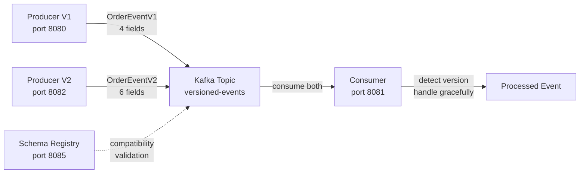

# Lesson 12 — Schema Evolution

## Scenario

An e-commerce platform has two versions of its order service running simultaneously. The **v1 producer** sends order events with 4 fields (the original schema). The **v2 producer** sends order events with 6 fields (adding shipping address and loyalty tier). A single **consumer** must handle both event versions without breaking — this is schema evolution in action.



## Kafka Concepts Covered

- **Schema Evolution** — changing the structure of messages over time while maintaining compatibility between producers and consumers
- **Backward Compatibility** — new consumers can read data produced by old producers (V2 consumer reads V1 events)
- **Forward Compatibility** — old consumers can read data produced by new producers (V1 consumer reads V2 events by ignoring unknown fields)
- **Full Compatibility** — both backward and forward compatible (what we demonstrate here)
- **Schema Registry** — a centralized service that stores and validates schemas, enforcing compatibility rules (Confluent Schema Registry runs alongside Kafka for reference)
- **Tolerant Reader Pattern** — the consumer uses `@JsonIgnoreProperties(ignoreUnknown = true)` and nullable fields to gracefully handle any schema version
- **Schema Versioning** — the consumer detects which version of an event it received based on the presence or absence of optional fields

## Architecture

| Service | Port | Role |
|---------|------|------|
| Kafka (KRaft) | 9092 | Message broker |
| Schema Registry | 8085 | Schema storage and compatibility enforcement |
| Producer V1 | 8080 | Sends OrderEventV1 (4 fields) every 10s |
| Producer V2 | 8082 | Sends OrderEventV2 (6 fields) every 10s |
| Consumer | 8081 | Reads both versions from `versioned-events` topic |
| AKHQ | 8888 | Web UI — topic browser, live messages, consumer group lag |

### Event Schemas

**V1 — Original schema (4 fields):**
```json
{
  "orderId": "ORD-1001",
  "customerEmail": "alice@gmail.com",
  "totalPrice": 149.99,
  "createdAt": "2026-03-27T10:15:30Z"
}
```

**V2 — Extended schema (6 fields, adds `shippingAddress` and `loyaltyTier`):**
```json
{
  "orderId": "ORD-2001",
  "customerEmail": "bob@outlook.com",
  "totalPrice": 249.99,
  "shippingAddress": "123 Main St, Springfield",
  "loyaltyTier": "GOLD",
  "createdAt": "2026-03-27T10:15:45Z"
}
```

**Consumer model — Superset (handles both):**
The consumer defines a class with ALL fields. When a V1 event arrives, `shippingAddress` and `loyaltyTier` are `null`. When a V2 event arrives, all fields are populated.

## Running

```bash
./start.sh
```

This will build all three Spring Boot apps inside Docker, start Kafka in KRaft mode, launch the Schema Registry and AKHQ, and begin auto-generating events from both producers every 10 seconds.

## Exploring

### AKHQ — Visual Kafka Dashboard

AKHQ opens automatically at [localhost:8888](http://localhost:8888). Key views:

| View | URL | What to observe |
|------|-----|-----------------|
| **Live Messages** | [versioned-events/data](http://localhost:8888/ui/kafka-playbook/topic/versioned-events/data?sort=NEWEST&partition=All) | Watch V1 and V2 events interleaved on the same topic |
| **Topic Detail** | [versioned-events](http://localhost:8888/ui/kafka-playbook/topic/versioned-events) | Partition count, message count, size |
| **Consumer Groups** | [groups](http://localhost:8888/ui/kafka-playbook/group) | See `versioned-consumer-group` offset lag per partition |

Things to try in AKHQ:
- Click a message row to expand the full JSON — compare V1 payloads (4 fields) with V2 payloads (6 fields)
- Filter by key prefix (`ORD-1` for V1, `ORD-2` for V2) to isolate each producer's events
- Stop the consumer (`docker compose stop consumer`) and watch lag increase, then restart and watch it catch up

### Watch the consumer process both versions

```bash
docker compose logs -f consumer
```

You should see interleaved output like:

```
============================================
  ORDER EVENT (Schema V1)
--------------------------------------------
  Order:    ORD-1001
  Email:    alice@gmail.com
  Total:    $149.99
  Address:  (not provided)
  Tier:     (not provided)
============================================

============================================
  ORDER EVENT (Schema V2)
--------------------------------------------
  Order:    ORD-2001
  Email:    bob@outlook.com
  Total:    $249.99
  Address:  123 Main St, Springfield
  Tier:     GOLD
============================================
```

### Send manual orders

```bash
# Send a V1 order (4 fields)
curl -s -X POST http://localhost:8080/api/orders/sample | jq .

# Send a V2 order (6 fields, includes address and loyalty tier)
curl -s -X POST http://localhost:8082/api/orders/sample | jq .
```

### Query the Schema Registry

The Schema Registry runs at port 8085. While this lesson uses Jackson-based schema evolution (not Avro/Protobuf), the Schema Registry is available for exploration:

```bash
# List all registered subjects
curl -s http://localhost:8085/subjects | jq .

# Check Schema Registry health
curl -s http://localhost:8085/ | jq .

# Get top-level config (default compatibility level)
curl -s http://localhost:8085/config | jq .

# Change compatibility level for a subject (example)
curl -s -X PUT http://localhost:8085/config \
  -H "Content-Type: application/vnd.schemaregistry.v1+json" \
  -d '{"compatibility": "BACKWARD"}' | jq .
```

### Inspect the topic

```bash
docker compose exec kafka /opt/kafka/bin/kafka-topics.sh \
  --bootstrap-server localhost:9092 --describe --topic versioned-events
```

### Read raw messages from the topic

```bash
docker compose exec kafka /opt/kafka/bin/kafka-console-consumer.sh \
  --bootstrap-server localhost:9092 --topic versioned-events --from-beginning
```

## How Schema Evolution Works Here

### The Tolerant Reader Pattern

The consumer uses a **superset model** (`OrderEventFull`) that contains every field from every schema version:

```java
@JsonIgnoreProperties(ignoreUnknown = true)
public class OrderEventFull {
    private String orderId;          // V1 + V2
    private String customerEmail;    // V1 + V2
    private BigDecimal totalPrice;   // V1 + V2
    private String shippingAddress;  // V2 only (null for V1)
    private String loyaltyTier;      // V2 only (null for V1)
    private Instant createdAt;       // V1 + V2
}
```

- `@JsonIgnoreProperties(ignoreUnknown = true)` — if a future V3 producer adds fields the consumer doesn't know about, they are silently ignored
- Nullable fields (`shippingAddress`, `loyaltyTier`) — when absent from V1 events, these default to `null`
- Version detection — the consumer checks `if (shippingAddress != null || loyaltyTier != null)` to determine which version it received

### Compatibility Types

| Type | Rule | Example |
|------|------|---------|
| **Backward** | New schema can read old data | V2 consumer reads V1 events (missing fields default to null) |
| **Forward** | Old schema can read new data | V1 consumer reads V2 events (extra fields ignored) |
| **Full** | Both backward and forward | Our consumer handles both directions |
| **None** | No compatibility enforced | Any change allowed (dangerous in production) |

### Safe Schema Evolution Rules

| Safe Change | Why |
|-------------|-----|
| Add an optional field | Old consumers ignore it, new consumers default it to null |
| Add a field with a default value | Same as above |
| Remove an optional field | New consumers ignore its absence |

| Unsafe Change | Why |
|---------------|-----|
| Remove a required field | Old consumers break when it's missing |
| Rename a field | Treated as remove + add — both sides break |
| Change a field's type | Deserialization fails (e.g., String to Integer) |

## Key Takeaways

1. **Schema evolution is inevitable** — as your system grows, event schemas will change. Plan for it from day one by making all fields optional or providing defaults.
2. **The Tolerant Reader pattern** — consumers should ignore unknown fields and handle missing fields gracefully. This is the simplest and most robust approach to schema evolution.
3. **Backward compatibility is the minimum** — ensure new consumers can always read old data. This lets you deploy consumers before producers.
4. **Schema Registry adds governance** — in production, use Confluent Schema Registry with Avro or Protobuf to enforce compatibility rules automatically at the broker level, preventing incompatible schemas from being published.
5. **Version detection** — when you need version-specific logic, detect the version from the data itself (presence/absence of fields) rather than relying on external metadata.
6. **Multiple producers, one topic** — Kafka topics are schema-agnostic. Different producer versions can write to the same topic simultaneously, which is essential for rolling deployments.

## Teardown

```bash
docker compose down -v
```
