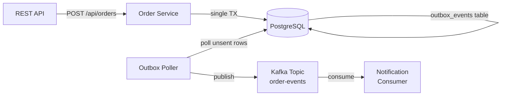

# Lesson 13 — Outbox Pattern

## Scenario

An e-commerce platform needs to create orders **and** publish events reliably. The naive approach (write to DB, then publish to Kafka) suffers from the **dual-write problem**: if the app crashes after the DB write but before the Kafka publish, the event is lost. The **transactional outbox pattern** solves this by writing the order and the event to the same database in a single transaction, then a separate poller publishes events to Kafka.



## The Dual-Write Problem

When a service needs to update a database **and** send a message to Kafka, two things can go wrong:

1. **DB succeeds, Kafka fails** — the order exists but no event is published. Downstream services never learn about it.
2. **Kafka succeeds, DB fails** — an event is published for an order that doesn't exist.

There is no way to make a database transaction and a Kafka publish atomic without a coordination protocol. The outbox pattern sidesteps this entirely.

## How the Outbox Pattern Works

1. The order service writes to the `orders` table **and** the `outbox_events` table in a **single database transaction**. If either write fails, both are rolled back.
2. A **poller** (running on a schedule) reads unsent rows from `outbox_events`, publishes each to Kafka, and marks them as `sent = true`.
3. If the poller crashes after publishing but before marking as sent, it will re-publish the event on the next poll. This gives **at-least-once delivery**, so consumers must be **idempotent**.

## Kafka Concepts Covered

- **Outbox Pattern** — write events to a database table as part of the business transaction, then relay them to Kafka
- **Dual-Write Problem** — the impossibility of atomically updating two separate systems (DB + Kafka)
- **Transactional Outbox** — using the database as a reliable staging area for events
- **Reliable Event Publishing** — guaranteeing that every committed business change produces a corresponding event
- **At-Least-Once Delivery** — the poller may re-publish events; consumers must handle duplicates
- **Idempotency** — consumers should safely process the same event more than once

## Architecture

| Service | Port | Role |
|---------|------|------|
| Order Service | 8080 | REST API + DB writes + outbox poller + Kafka producer |
| Notification Consumer | 8081 | Kafka consumer, logs notifications |
| PostgreSQL | 5432 | orders + outbox_events tables |
| Kafka (KRaft) | 9092 | Message broker |
| AKHQ | 8888 | Web UI — topic browser, live messages, consumer group lag |

## Running

```bash
./start.sh
```

This will build both Spring Boot apps inside Docker (first run downloads Maven dependencies — takes a few minutes), start Kafka in KRaft mode, PostgreSQL, AKHQ, and begin auto-generating orders every 10 seconds. Chrome opens automatically to the AKHQ live message view.

## Exploring

### AKHQ — Visual Kafka Dashboard

AKHQ opens automatically at [localhost:8888](http://localhost:8888). Key views:

| View | URL | What to observe |
|------|-----|-----------------|
| **Live Messages** | [order-events/data](http://localhost:8888/ui/kafka-playbook/topic/order-events/data?sort=NEWEST&partition=All) | Watch OrderCreatedEvent JSON payloads arrive via the outbox poller |
| **Topic Detail** | [order-events](http://localhost:8888/ui/kafka-playbook/topic/order-events) | Partition count, replication, message count, size |
| **Consumer Groups** | [groups](http://localhost:8888/ui/kafka-playbook/group) | See `notification-group` offset lag per partition |
| **All Topics** | [topics](http://localhost:8888/ui/kafka-playbook/topic) | Internal topics + your `order-events` |

Things to try in AKHQ:
- Click a message row to expand the full JSON payload, headers, key, and partition/offset
- Filter messages by key (e.g., `ORD-1001`) to see all events for one order
- Stop the notification consumer (`docker compose stop notification-consumer`) and watch lag increase, then restart it and watch it catch up

### Watch the notification consumer

```bash
docker compose logs -f notification-consumer
```

You should see output like:

```
============================================
  ORDER NOTIFICATION
--------------------------------------------
  Order:    ORD-1001
  Email:    alice@example.com
  Product:  Wireless Headphones (x2)
  Total:    $79.98
  Status:   Reliably delivered via outbox
============================================
```

### Watch the order service (outbox flow)

```bash
docker compose logs -f order-service
```

You should see:

```
[ORDER] Created ORD-1001 | alice@example.com | Wireless Headphones (x2) | $79.98
[OUTBOX] Written to outbox: event_type=ORDER_CREATED, aggregate_id=ORD-1001
[OUTBOX-POLLER] Published ORD-1001 to Kafka | Marked as sent
```

### Send a custom order

```bash
curl -X POST http://localhost:8080/api/orders \
  -H "Content-Type: application/json" \
  -d '{
    "customerEmail": "you@example.com",
    "productName": "Mechanical Keyboard",
    "quantity": 1,
    "totalPrice": 149.99
  }'
```

### Send a random sample order

```bash
curl -X POST http://localhost:8080/api/orders/sample
```

### List all orders from the database

```bash
curl -s http://localhost:8080/api/orders | python3 -m json.tool
```

### Inspect the topic

```bash
docker compose exec kafka /opt/kafka/bin/kafka-topics.sh \
  --bootstrap-server localhost:9092 --describe --topic order-events
```

### Read raw messages from the topic

```bash
docker compose exec kafka /opt/kafka/bin/kafka-console-consumer.sh \
  --bootstrap-server localhost:9092 --topic order-events --from-beginning
```

## Key Takeaways

1. **Atomicity** — writing the order and the outbox event in a single database transaction guarantees they either both succeed or both fail. No event is ever lost due to a partial failure.
2. **At-Least-Once Delivery** — the poller may re-publish an event if it crashes between publishing and marking as sent. This is safe as long as consumers are idempotent.
3. **Idempotency** — consumers should handle duplicate events gracefully (e.g., by tracking processed event IDs or making operations naturally idempotent).
4. **Simplicity** — this polling-based outbox avoids the operational complexity of Debezium/Kafka Connect (covered in Lesson 11) while providing the same reliability guarantee.
5. **Trade-off** — the polling interval (2 seconds here) adds latency compared to direct Kafka publishing or CDC-based approaches. For most use cases, this is acceptable.

## Testing

This lesson includes end-to-end BDD tests using **Testcontainers** with real Kafka and PostgreSQL containers. The tests are in the `order-service` project.

### Running the tests

```bash
cd order-service && mvn test
```

### Test scenarios

The test class `OutboxFlowTest` verifies three scenarios using `@SpringBootTest` + `@Testcontainers` + `KafkaContainer` + `PostgreSQLContainer`:

1. **Given an order is created via the order service, when the transaction commits to both orders and outbox_events tables, then the outbox row is marked as unsent** -- Creates an order through `OrderService.createOrder()` and verifies that both the `orders` table and `outbox_events` table contain the expected data, with the outbox event's `sent` flag set to `false`.

2. **Given an unsent outbox event exists, when the outbox poller runs, then the event is published to Kafka and marked as sent** -- Creates an order (which writes an unsent outbox row), then manually triggers `OutboxPoller.pollAndPublish()`, and verifies the outbox row is updated to `sent = true`.

3. **Given the full e2e flow, when an order is created, then a notification event arrives on the order-events Kafka topic** -- Creates an order, triggers the poller, then consumes from the `order-events` Kafka topic using a test consumer and verifies the `OrderCreatedEvent` payload matches the original order.

The tests use `@DynamicPropertySource` to inject both the Testcontainers Kafka bootstrap servers and PostgreSQL JDBC URL into the Spring context. The PostgreSQL container is initialized with `init-db.sql` to create the `orders` and `outbox_events` tables.

### Dependencies added

- `spring-boot-starter-test` -- JUnit 5, AssertJ, Mockito
- `spring-kafka-test` -- Kafka testing utilities
- `testcontainers:kafka` -- Kafka container for integration tests
- `testcontainers:postgresql` -- PostgreSQL container for integration tests
- `testcontainers:junit-jupiter` -- JUnit 5 integration for Testcontainers
- `awaitility` -- fluent async assertions

## Teardown

```bash
docker compose down -v
```
